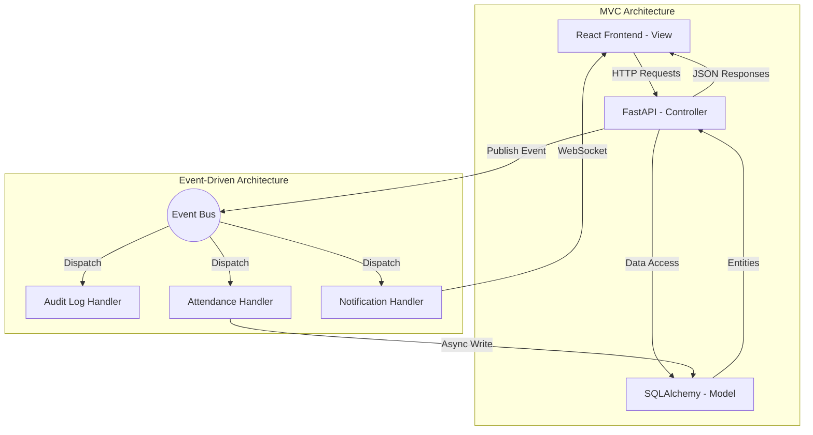

# System Architecture

## Hybrid Architecture Approach

The system employs a **Hybrid Architecture** comprising two primary architectural styles:

1. **Model-View-Controller (MVC)**
2. **Event-Driven Architecture**

## How It Works
- **MVC:** Used for standard HTTP requests. For example, when a user wants to view the list of students, the View requests it from the Controller, which reads from the Model and returns the data.
- **Event-Driven:** Used to decouple heavy or side-effect operations. When a face is successfully recognized by the AI engine, the Face Controller does *not* directly write attendance. It publishes a `FaceRecognized` event. The Event Bus then dispatches this to the `AttendanceHandler`, which safely inserts the record into the database, handling duplicate checks asynchronously.
